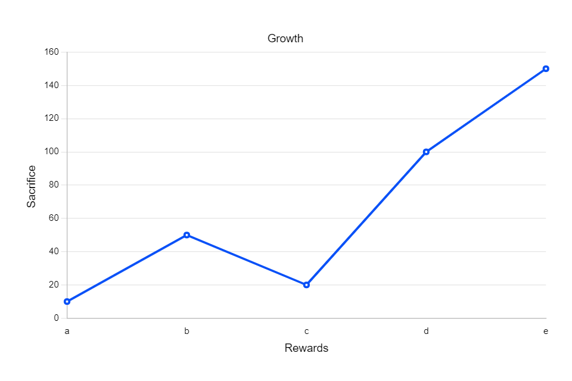

---
### ✍️ Random Dev Quote

# 💫 About Me:
- 🎓 Final-year computer engineering student at DBATU, specializing in Python and SQL.

- 👨‍💻 Leader and lead developer in diverse academic projects: Web Dev, IoT, Python-GUI.

- 🚀 Exploring AI with Language Models (LLMs) and LangChain; working on an Azure-based chatbot.

- 🧠 Eager learner, always staying updated on the latest tech trends.

- 😊 Aspiring to make a positive impact in the tech world through innovation and skills.

## Quote

> The bigger the sacrifice, the bigger the reward.

## 🌐 Socials:
 

# 💻 Tech Stack:
      

### 😂 Random Dev Meme

